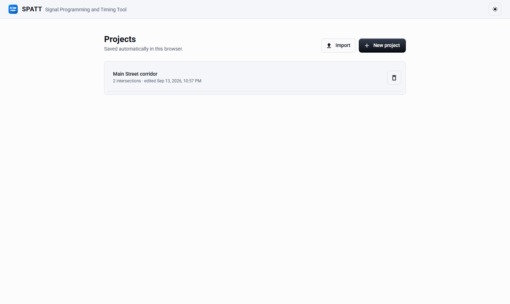
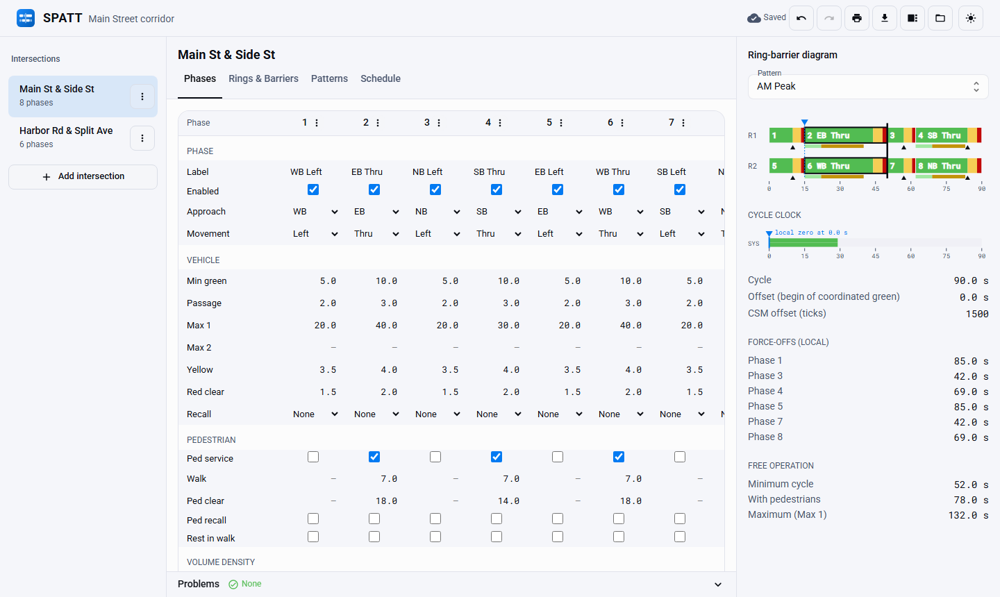
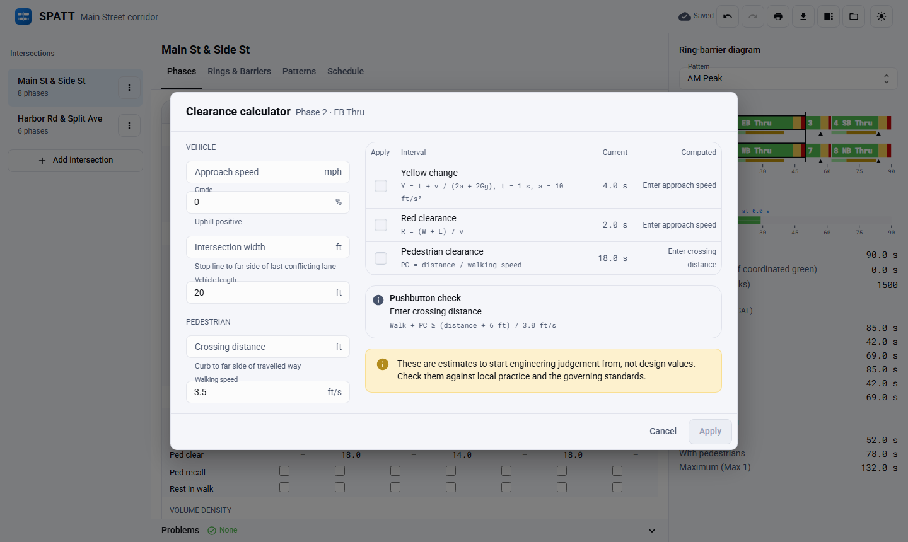
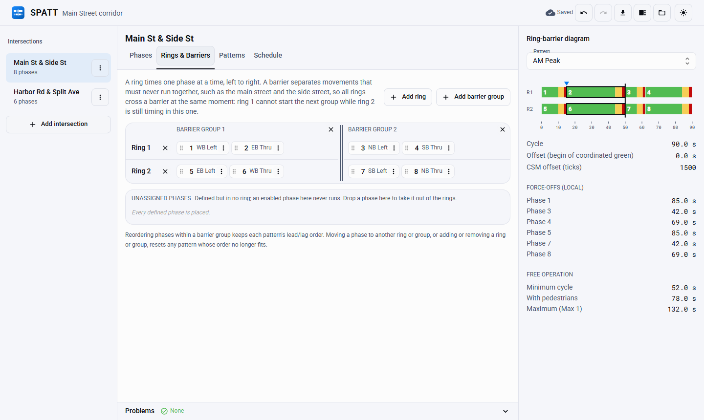
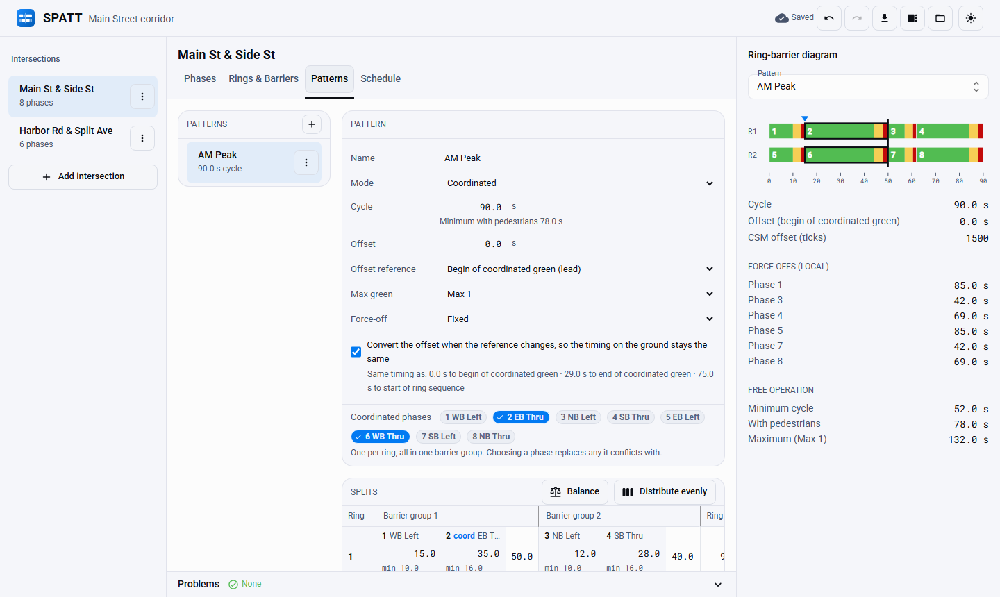
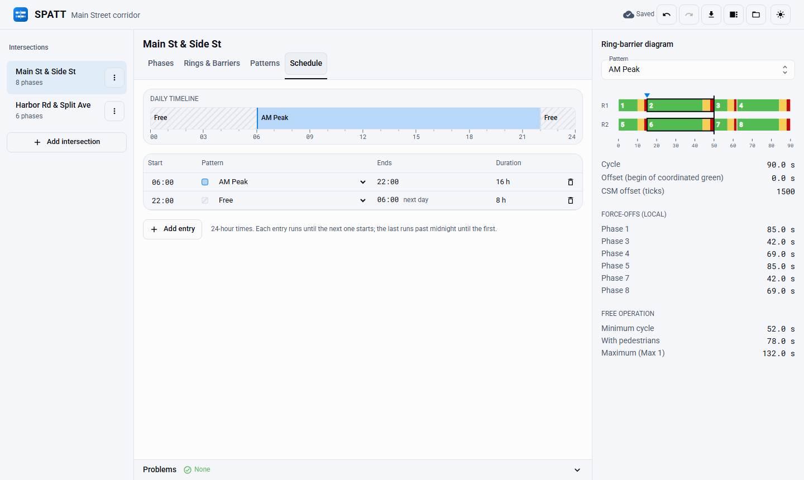
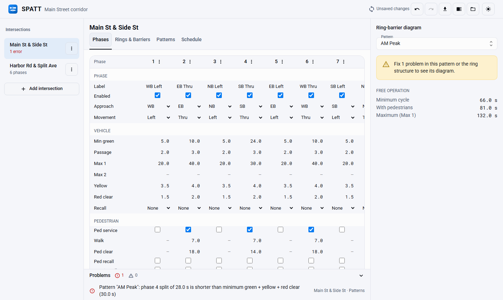
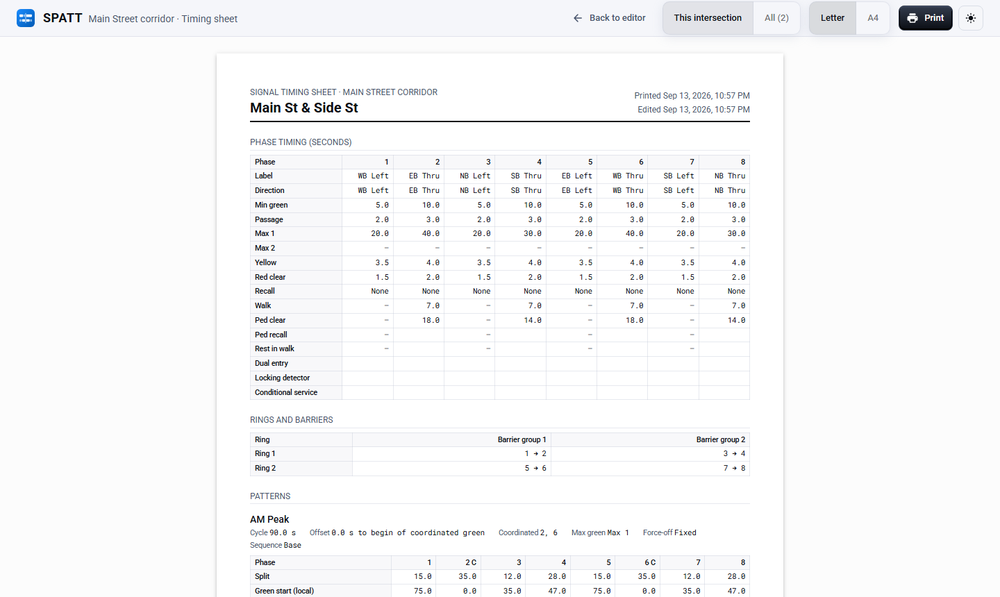

# Using the Editor

This page walks through timing one intersection: from an empty project to a coordinated pattern
on a daily schedule. The terms used here are defined in [Concepts](../concepts/index.md).

## Projects

SPATT opens on the project library. A project holds any number of intersections (and, later,
corridors). Projects save automatically a moment after every change and again when you close
the window, so there is no Save button:

| Host | Where projects are kept |
|---|---|
| Desktop app | A `projects` folder in the app's data directory (on Windows, `%APPDATA%\com.micatechnologies.spatt\projects`) |
| Browser | This browser's storage, on this device only |
| Network server | The server's data folder, shared by every device that uses it (coming with the network server) |

**Export** (the download button in the header) writes the whole project to a `.spatt.json` file;
**Import** on the library screen reads one back as a new project, so importing the same file
twice never overwrites anything. Use export to move projects between computers or to keep a copy
in version control. The format is documented in [Project File Format](../developer/project-format.md).

## The workspace

- **Sidebar.** The project's intersections. **Add intersection** starts from a template: a
  standard eight-phase intersection, eight-phase with a lagging left, a split-phased side street,
  two-phase, or the CSM ASC-3 controller's defaults, or imports a plan from that controller.
  Each intersection's menu renames, duplicates, exports for the controller, or deletes it (see
  [CSM ASC-3](../profiles/csm-asc3.md)).
- **Tabs.** Phases, Rings & Barriers, Patterns and Schedule, described below.
- **Ring-barrier diagram.** Docked on the right on wide windows (toggle it from the header). See
  [The ring-barrier diagram](#the-ring-barrier-diagram) below.
- **Problems.** Every validation error and warning in the project. Click one to jump to the field
  it is about. A plan with errors still opens and saves, so it can be fixed.
- **Undo and redo.** Every edit is one step: the header buttons, or ++ctrl+z++ and ++ctrl+y++ when
  the cursor is not in a text field.

Values are entered in seconds and stored to the tenth. Grid fields commit when you press
++enter++ or leave the field; ++esc++ puts the old value back.

## Phases

Phases run across the grid in columns, as on a controller's phase timing screen. Rows are grouped
into phase identity (label, direction of travel, movement), vehicle timing, pedestrian timing and
volume density. A dash means the value is not used, for example walk on a phase without
pedestrian service.

**Add phase** under the grid adds the next free phase number (up to 16). The menu on a phase
column's header deletes the phase or opens the **clearance calculator**:

Enter the approach speed, grade, intersection width and crossing distance, tick the intervals to
apply, and SPATT writes the yellow change, red clearance and pedestrian clearance (rounded up to
the tenth) together with the inputs it used. The pushbutton check compares walk plus pedestrian
clearance with the time to cross from the pushbutton. The results are a starting point for
engineering judgement, not design values.

## Rings & Barriers

Each row is a ring and each column a barrier group; a ring times its phases left to right. Drag a
phase to move it, or use the phase's menu (the keyboard-friendly way): **Move earlier** and
**Move later** reorder a lead/lag pair within a group, and **Move to** sends it to another ring or
group. A phase dropped on **Unassigned phases** is taken out of the rings and never runs.

A ring can be empty in a group, which is how split phasing is set up: in the screenshot's second
intersection, ring 1 times the side-street approaches one after the other while ring 2 waits at
the barrier.

Moving a phase to another ring or group, or adding or removing a ring or group, resets any
pattern's own phase order that no longer fits.

## Patterns

A pattern is one coordination plan: mode (coordinated or free), cycle, offset and its reference
point, max green selection, force-off mode, coordinated phases, splits and optionally its own
lead/lag order.

- **Offset reference.** Changing the reference converts the offset so the timing on the ground
  stays the same (untick the option to keep the number instead). The line underneath shows the
  same timing expressed against every reference.
- **Splits.** One row per ring, phases in timing order, grouped by barrier. Under each split are
  its minimums: minimum green plus clearances, and walk plus pedestrian clearance plus
  clearances. Group totals must match across rings, and the groups must add up to the cycle; the
  status line under the grid says what is left over. A ring that waits out a split-phased group
  counts that wait in its ring total.
- **Balance** raises any split below its minimum, lines the rings up at each barrier, then fits
  the groups to the cycle: spare time goes to the coordinated phases, and excess time comes off
  the coordinated phases first and then the other phases, never below a minimum.
- **Distribute evenly** replaces the splits, sharing the cycle in proportion to each phase's
  minimum green and pedestrian time.
- **Phase sequence.** Swap a lead/lag pair for this pattern only; **Use base sequence** returns to
  the order on the Rings & Barriers tab.

## Schedule

The daily schedule picks a pattern (or free operation) by time of day. Each entry runs from its
start time until the next entry starts, and the last one runs past midnight until the first.
The timeline above the list shows the whole day.

## Problems

Validation runs after every change. Here, raising phase 4's minimum green to 24 s left its 28 s
split shorter than green plus clearances: the intersection shows the error in the sidebar, the
diagram outlines phase 4 in red, and clicking the problem opens the Patterns tab with the split
selected. **Balance** or a longer split clears it. Every rule and its code is listed in
[Project File Format](../developer/project-format.md).

## The ring-barrier diagram

The diagram draws the selected pattern across one cycle:

- one lane per ring, each split coloured green, yellow and red clearance, with the walk and
  pedestrian clearance intervals as a thin strip underneath;
- heavy vertical lines at the barriers, and a heavy outline around the coordinated phases;
- a small triangle under each non-coordinated phase at its force-off;
- a blue marker and dashed line at local zero, the point the offset is measured to.

The scale runs from the start of barrier group 1. Hover over a phase for its split, its green
start and force-off (or yield point) in local time, and its pedestrian times.

The **cycle clock** underneath shows the same cycle on the shared system clock: local zero sits at
the offset, and the coordinated phases' green is shaded where it falls. Two intersections on the
same cycle whose coordinated greens line up on this strip turn green together.

A pattern with timing errors, such as a split shorter than minimum green, is still drawn with the
affected phases outlined in red. When the layout itself is undefined (rings that would miss a
barrier, splits that do not add up to the cycle, no coordinated phase, a split too short for its
own yellow and red clearance) the panel asks you to fix those problems first.

## Timing sheets

The print button in the header opens the timing sheet preview. Choose **This intersection** or
**All**, and **Letter** or **A4**, then **Print** to use the system print dialog, which can also
save a PDF. Each sheet has:

- the phase timing table, with the same fields as the Phases tab;
- the ring and barrier structure;
- each pattern's cycle, offset and its reference, coordinated phases, splits, green starts and
  force-offs in local time, its ring-barrier diagram with a legend, and its cycle clock;
- the daily schedule with end times and durations;
- any unresolved problems, and the intersection's notes.

Sheets always print in light colours, and every intersection starts on a new page. **Back to
editor** returns to where you were.
