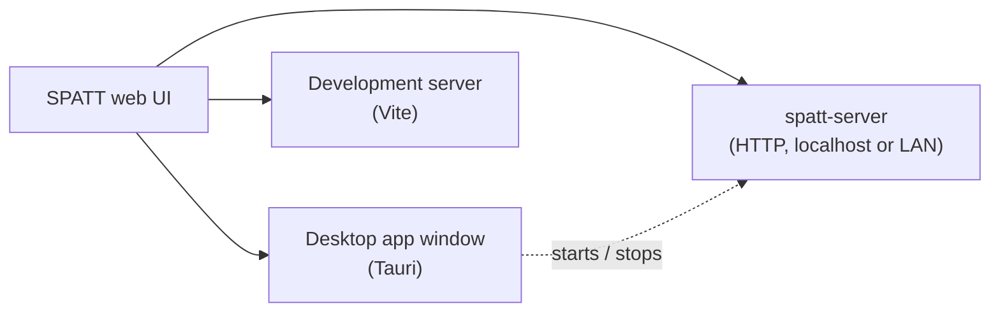

# Desktop, Network and Headless

SPATT's interface is a single web application. It runs unchanged in three hosts, and only two
things differ between them: where projects are saved, and whether the manager window exists.



## Desktop app

Launching SPATT opens the **SPATT Manager**, a small window that:

- opens SPATT itself in its own window;
- starts and stops the built-in network server, and chooses whether it serves only this computer
  or your local network;
- shows where projects are kept, and recent server activity.

Projects are kept in the app's data folder (`projects` inside `%APPDATA%\com.micatechnologies.spatt`
on Windows, `~/Library/Application Support/com.micatechnologies.spatt` on macOS,
`~/.local/share/com.micatechnologies.spatt` on Linux).

## Sharing SPATT on your network

1. In the manager, press **Start**. The server now answers on this computer at
   `http://127.0.0.1:8787/` (**Open in browser**). Change the port before starting if 8787 is in
   use.
2. Turn on **Share on the local network**. The manager shows an **access link** with a QR code.
3. On a phone, tablet or another computer on the same network, open the link or scan the code.
   The link signs that browser in and it is remembered; the address bar then shows the plain
   address without the token.

Every device, and the SPATT window on the host computer, works on the **same project library**.
Your system may ask whether SPATT may accept network connections the first time it shares.

**Access.** Other devices always need the access link or its token; the host computer never
does. A browser that opens the plain address without it is asked to paste the token, which the
manager shows. **Generate a new token** (the refresh button) signs every other device out until
it is given the new link.

**Editing on two devices at once.** Every save checks that the project has not changed since
that device last loaded or saved it. If it has, saving pauses and a banner offers:

| Choice | Result |
|---|---|
| **Load their version** | Replaces what this device shows with the saved version; unsaved edits here are discarded. |
| **Keep mine** | Saves this device's version over theirs. |
| **Save mine as a copy** | Saves this device's version as a new project, *Name (copy)*, and leaves theirs as it is. |

Nothing is ever overwritten silently.

**Closing the manager.** While the server runs, closing the manager keeps it serving and puts a
SPATT icon in the system tray, with **Open SPATT**, **Open manager**, **Stop server** and **Quit
SPATT**. Turn off **Keep serving in the tray when this window is closed** to stop the server when
the manager closes instead.

## Headless server

`spatt-server` is the same server without a window, for an always-on machine (a home server, a
Raspberry Pi, a NAS) or a Linux box without a desktop. Download it from the
[release page](installation.md) and run it:

```bash
spatt-server                          # this computer only, http://127.0.0.1:8787/
spatt-server --bind 0.0.0.0           # your network; prints an access link with a new token
spatt-server --config spatt-server.toml
```

| Flag | Config key | Default |
|---|---|---|
| `--bind <ip>` | `bind` | `127.0.0.1` (this computer only) |
| `--port <n>` | `port` | `8787` |
| `--data <folder>` | `data_dir` | the desktop app's data folder for this user; projects go in `<folder>/projects` |
| `--token <token>` | `token` | none; generated for the run when binding to the network |
| `--config <file>` | | none |

Flags override the file. A token must be at least 16 letters, digits, `-` or `_`. Without a
configured token, binding to the network generates a new one at every start, so set `token` in
the config file to keep links working across restarts:

```toml
bind = "0.0.0.0"
port = 8787
data_dir = "/srv/spatt"
token = "replace-with-a-long-random-string"
```

The server logs the projects folder, the access link and every API request (never the token).
Stop it with ++ctrl+c++. Running it as a background service is described under
[Background modes](#background-modes-planned).

!!! warning "Home networks only"
    The server speaks plain HTTP and is meant for a trusted local network. Do not expose it to the
    internet.

## Background modes (planned)

The desktop app will be able to keep the server running without a window:

| Mode | Starts | Needs admin | Tray icon |
|---|---|---|---|
| **Start at login** | When you sign in | No | Yes, from the same process |
| **System service** | At boot, before anyone signs in | Yes | Yes, from a small tray companion |

A system service (Windows Service, systemd unit, launchd daemon) runs outside any user session
and cannot draw a tray icon itself, which is why that mode pairs it with a companion. Both modes
will be available from the manager and from the command line (`--install-headless`).
