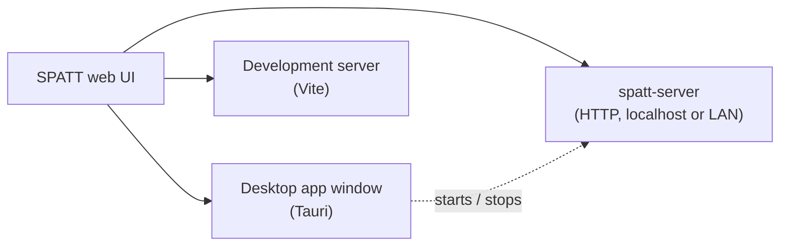

# Desktop, Network and Headless

SPATT's interface is a single web application. It runs unchanged in three hosts, and only two
things differ between them: where projects are saved, and whether the manager window exists.

## Desktop app

Launching SPATT opens the **SPATT Manager**, a small window that:

- opens SPATT itself in its own window;
- starts and stops the built-in network server, and chooses whether it serves only this computer
  or your local network;
- shows the app version and platform.

!!! note "In progress"
    The manager's server controls and background modes are on the [roadmap](../roadmap.md) and
    not in current builds yet. The window and **Open SPATT** work today.

## Network server

The same server runs inside the desktop app or as the standalone `spatt-server` executable. It
serves the web UI and, as projects arrive, an API that stores them on the server machine, so
every browser on your network sees the same projects.

It listens on `127.0.0.1:8787` by default: only the computer it runs on can reach it. Serving
your network is always an explicit choice (`--bind 0.0.0.0`, or the manager's toggle).

## Background modes (planned)

The desktop app will be able to keep the server running without a window:

| Mode | Starts | Needs admin | Tray icon |
|---|---|---|---|
| **Start at login** | When you sign in | No | Yes, from the same process |
| **System service** | At boot, before anyone signs in | Yes | Yes, from a small tray companion |

A system service (Windows Service, systemd unit, launchd daemon) runs outside any user session
and cannot draw a tray icon itself, which is why that mode pairs it with a companion. Both modes
will be available from the manager and from the command line (`--install-headless`).
